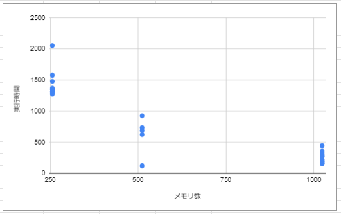
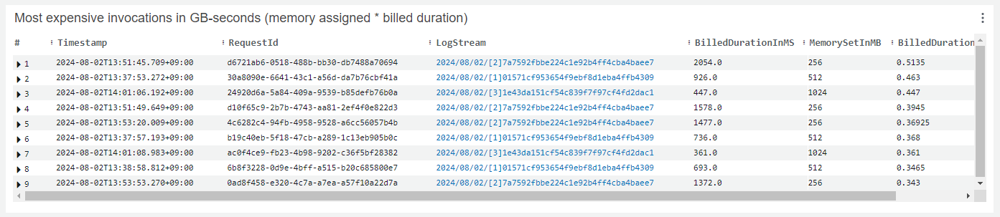

# AWS Lambda のメモリ設定、損してませんか？

ponyoxa

@1周年！若手エンジニアふんわりLT Day！

---
transition: slide-left
layout: default
---

# 自己紹介
 

ponyoxa です、ぽにょって読んでください

TypeScript メインのバックエンドエンジニア

 

キーボードが好き。自作キーボードを組みたい今日このごろ

秋葉原付近をうろうろするのが好き

爬虫類も好き

アイコンは従妹に描いてもらいました

初めて slidev でスライドを作ったけどあまり使いこなせなかった orz

初めての LT !!

---
layout: center
transition: slide-left
---

ところでみなさん
 
 AWS Lambda は使ったことがありますか？

---
layout: default
transition: slide-left
---

# Lambda について簡単に

- メモリサイズを設定する

- 実行時間課金

---
layout: quote
transition: slide-left
---

# 公式ドキュメントには...

 

> Lambda は、設定されたメモリの量に比例して CPU パワーを割り当てます。

引用：https://docs.aws.amazon.com/ja_jp/lambda/latest/dg/configuration-memory.html

---
layout: center
transition: slide-left
---

ほんとですか？<emojione-thinking-face/>

---
layout: default
transition: slide-left
---

# 実験してみた

- Node ランタイム
- 外部と連携しない CPU 依存なプログラム
- プログラムが使用するメモリは 100MB 程度で、メモリ設定だけでいうと 256MB で十分

 

- 256MB, 512MB, 1024MB で設定
  - 実行時間の比較
  - コストの比較

---
layout: default
transition: slide-left
---

# 結果をざっくり その1
 

メモリ設定と実行時間の関係

---
layout: default
transition: slide-left
---

# 結果をざっくり その2
 

コストはどうだったか

---
layout: default
transition: slide-left
---

# 結論

- ドキュメント通り、メモリが倍になると CPU の速度も倍になる
- CPU 依存のプログラムの場合はメモリ設定を大きめにとったほうがコストが低くなる可能性がある
- プロビジョニングするときは課金システムが変わるので注意

---
layout: center
transition: slide-left
---

おわり！

 

2025年3月9日(日)に「エンジニアがこの先生きのこるためのカンファレンス」をやります！

コアスタッフやってます。ぜひ X のフォローしてください。
@kinoko_conf

